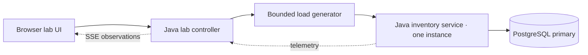
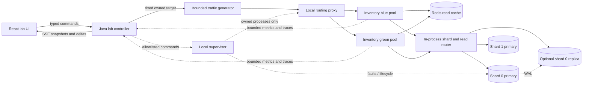
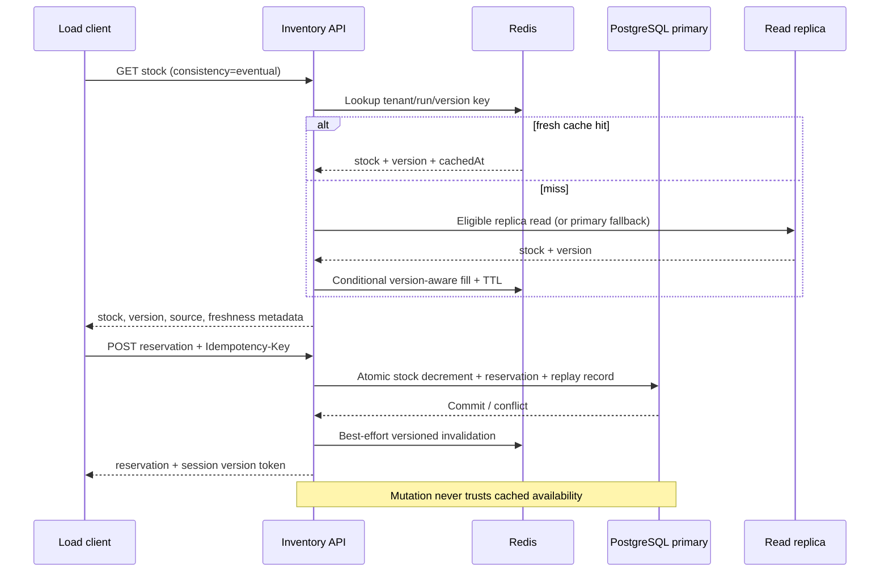

# Architecture and system design

All diagrams describe the target; the delivered prototype is static browser code only.

## Start small

Controller owns lessons, run lifecycle and observation; inventory knows inventory. The controller does not implement stock rules. The same normal inventory service can be called through HTTP outside the visual lab within the local network.

## Evolved teaching topology

This is an explanatory composite, **not the default all-at-once deployment**. Replication, sharding and deployment profiles activate only their necessary components. Each inventory instance has its own JDBC pools and router; the diagram collapses them for readability. No remote routing microservice. Redis namespaces include run, tenant, warehouse, SKU and schema version.

## Runtime boundaries

`LabRuntime` exposes prepare/run/command/snapshot/stop; application use cases call it. Simulation uses a seeded event queue; real mode calls fixed URLs and a local supervisor. Shared DTOs describe intent and observation, not a common fake database. Expose capabilities in snapshots so the UI cannot promise an unavailable operation.

The supervisor owns only child PIDs started under the current run or explicitly labelled containers. Browser/API must not mount or proxy a Docker socket. A local operator launches the supervisor from Make/CLI. A random per-launch secret and loopback channel authenticate controller requests; the supervisor permits a fixed operation enum and opaque resource IDs. If this boundary cannot be implemented securely, keep infrastructure start/stop as manual CLI actions and report observed state. Never shell-interpolate user input.

## Java modules and ownership

- `inventory-service/domain`: Stock, Reservation, tenant identity, quantity policies and error types. Plain Java.
- `inventory-service/application`: get stock, reserve, release, expiration; transaction and repository ports; idempotency protocol.
- `inventory-service/adapters`: Spring HTTP DTO mapping, JDBC repositories, Redis caching, datasource/read/shard routing, health/telemetry.
- `lab-controller/domain`: run state, lesson state, topology revisions, fault TTL and budgets.
- `lab-controller/application`: commands, allowed transitions, report creation, event replay.
- `lab-controller/adapters`: HTTP/SSE, seeded simulator, local runner and telemetry collectors.
- `frontend/features`: lab, workloads, guide, component inspector, request traces, compare, setup; run-scoped state, no global mutable topology singleton.

Use explicit per-run ownership and transaction boundaries. Avoid sharing inventory persistence models with API DTOs or simulator state. ArchUnit protects dependencies; new ports need a real boundary and at least one concrete use.

## Read and write flows

Read-your-writes: core implementation pins session-consistent reads to primary. Later optional replica eligibility checks a required version on the specific item (not a wall-clock guess); timeout falls back to primary or returns explicit unavailable. Pg replay timestamps alone cannot prove freshness on idle replicas. Use replay/write LSN and row versions where relevant; expose unknown lag as unknown.

## Persistence correctness

[ADR 002](adr/002-writable-inventory-contract.md) fixes the writable mechanism. Within one transaction, insert a unique `(tenant_id, idempotency_key)` claim, update inventory with `available >= quantity`, insert the reservation, store the canonical response and commit. Only `COMPLETED` claims are committed. A conflicting in-flight insert waits on that unique key until the request deadline, then returns retryable `IDEMPOTENCY_IN_PROGRESS`; rollback removes the uncommitted claim. A lost response replays the stored result and does not decrement again. Release or expiry transitions `ACTIVE` once and credits stock in the same transaction. No unguarded read-modify-write in Java.

## Caching trade-offs

Cache-aside is a latency/read-load technique with eventual consistency. TTL bounds some stale lifetime but not concurrent stale-fill races; delete-on-write alone is insufficient. Teach the race explicitly. Proposed repair uses row versions and a per-key version floor maintained by conditional Redis operations, with bounded tombstone lifetime at least exceeding maximum read/fill duration. If invalidation is lost, TTL is the fallback; strict reads bypass the cache. An optional outbox improves invalidation delivery, not instantaneous consistency. In-process single-flight does not coalesce across service instances; bounded Redis lease can demonstrate distributed coalescing but must use owner token/expiry and safe release. Cache locks never protect stock correctness.

## Replication and recovery

PostgreSQL physical streaming standby follows WAL. Asynchronous replicas trade freshness and potential failover loss for lower commit coupling. Synchronous acknowledgement has selectable durability semantics and may block when the required standby is unavailable. Show the configured mode, not a generic “strong” badge.

State progression: healthy → primary unreachable → writes halted → old primary fenced → target eligibility checked → explicit possible-loss acknowledgement → promote → route to new primary → verify known writes → reseed old primary as standby. Do not treat network loss as proof that the old primary stopped. On this laptop fencing means the supervisor verifies the old owned process is stopped and old routes disabled. A network-partition/multi-host variant needs stronger fencing/consensus and is out of core scope.

RTO starts at injected failure and ends at first sustained successful write window (5 seconds); show detect/promote/reroute durations. RPO report compares a pre-failure acknowledged-write ledger to recovered IDs; annotate unknown outcomes separately. An async failover may violate durability of prior acknowledged reservations; never hide it behind a green health icon.

## Sharding

Hash tenant ID with a specified stable SHA-256 byte-prefix algorithm to one of 16 buckets; bucket ownership map routes to two separate PostgreSQL instances. Use map epoch on commands, retries and telemetry. Tenants remain co-located; no cross-shard foreign keys/joins. Scatter-gather reports are out of the hot path. Adding a shard without moving ownership does nothing. Sharding tenants cannot split a single hot tenant/SKU; show this limitation.

Migration temporarily rejects writes to a bucket, drains operations, copies an immutable snapshot, verifies row counts/checksums including idempotency records, switches epoch atomically in the control-plane map, then resumes. Old routers receive stale-epoch error and reload; the old owner rejects writes. Rollback before switch discards the new copy; after switch requires another pause/sync, never blind map reversal.

## Deployment

Blue and green versions use one compatible schema and persisted idempotency. Prepare green → readiness + fixture smoke → switch proxy route atomically → drain blue up to a fixed deadline → stop blue. Preserve bounded retries at one layer only. Rollback to blue only while schema/data remain compatible. Use expand/backfill/dual-compatible code/contract sequence; destructive contract migration belongs after the rollback window.

## Sources and limits

Design checked against [PostgreSQL replication](https://www.postgresql.org/docs/17/warm-standby.html), [PostgreSQL partitioning](https://www.postgresql.org/docs/17/ddl-partitioning.html), [Redis cache-aside](https://redis.io/docs/latest/develop/use-cases/cache-aside/), [Java virtual threads](https://docs.oracle.com/en/java/javase/25/core/virtual-threads.html) and [Spring Boot requirements](https://docs.spring.io/spring-boot/system-requirements.html). Accessed 2026-09-29; exact supported patches must be rechecked at implementation. These references support component behaviour, not any unmeasured performance claim in this repository.

## Implemented Java bootstrap boundary

The owner explicitly requested Java for scripts and backend, local PostgreSQL for Make, and isolated PostgreSQL for Docker. `tools/Build.java` bootstraps two checksum-pinned libraries and compiles `tools/src/stockflow`. `Lab` handles CLI commands; `Dataset` streams and validates the public catalog; `Database` owns JDBC/schema/COPY transactions; `Preview` serves an explicit static-file allowlist and tracks owned processes through Java ProcessHandle. Browser actions have no database or process-control endpoint.

Make connects only to the configured loopback database and creates the stockflow schema. Compose creates its own database, waits for its health, runs the Java seed, then starts the read-only inventory API and Java preview. The mutable bootstrap catalog is not the future inventory domain/API: implement reservations, tenant-scoped keys and migrations in the approved service phase. [Dataset contract](dataset-and-scale.md) defines provenance, skip behavior and schema. No Python operational code remains.
