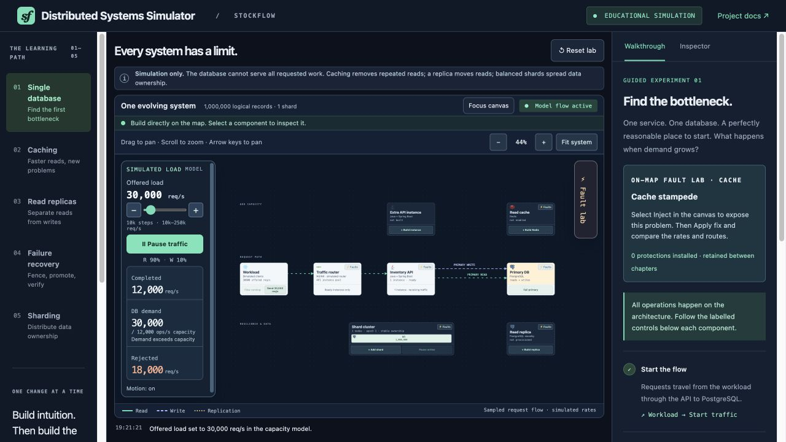
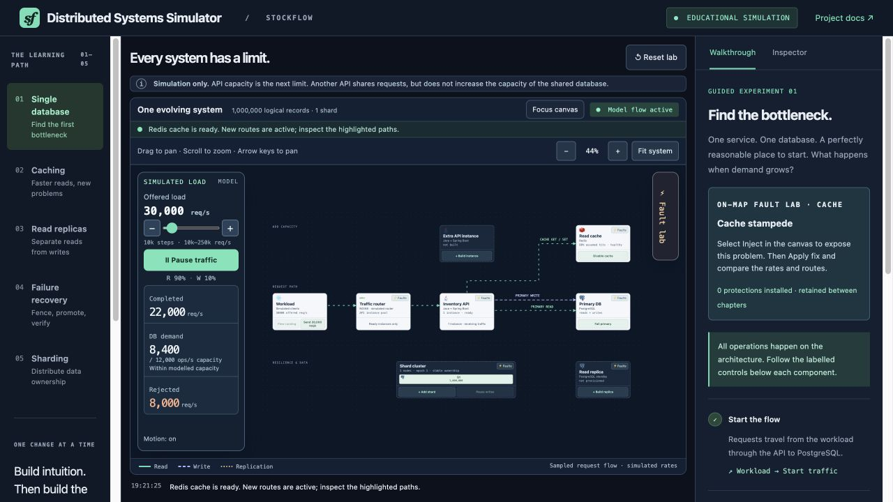
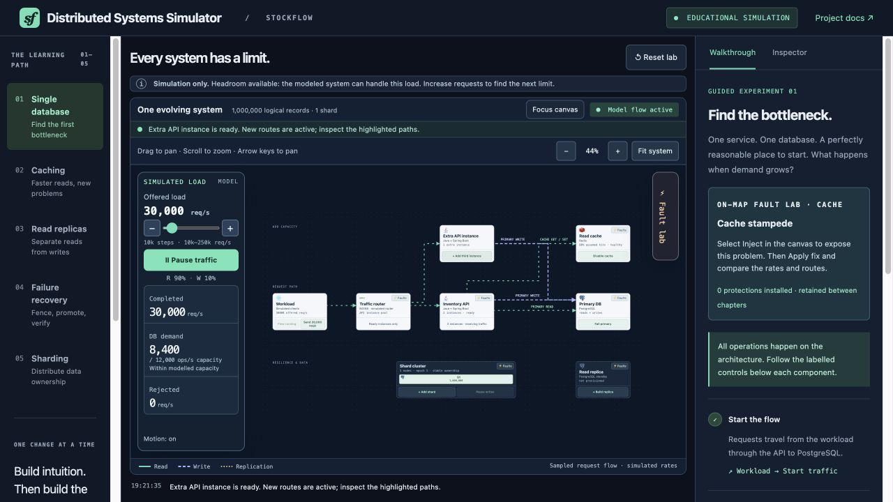
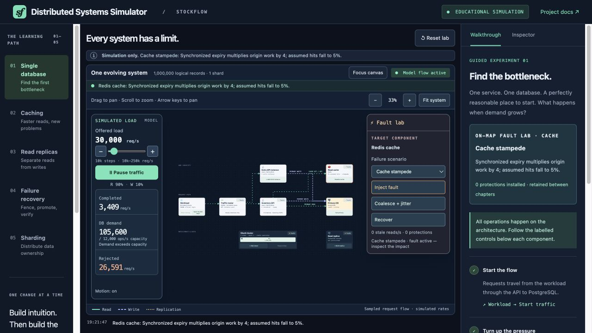
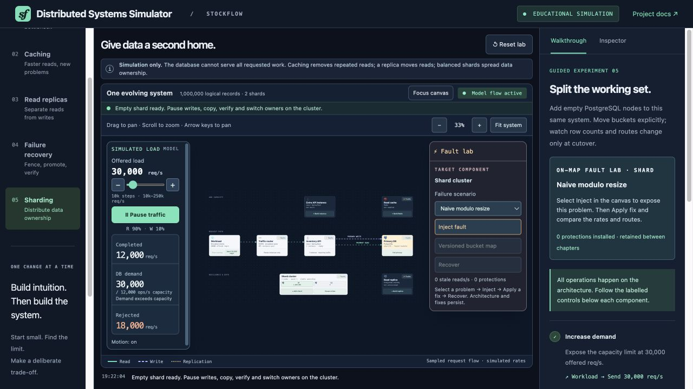
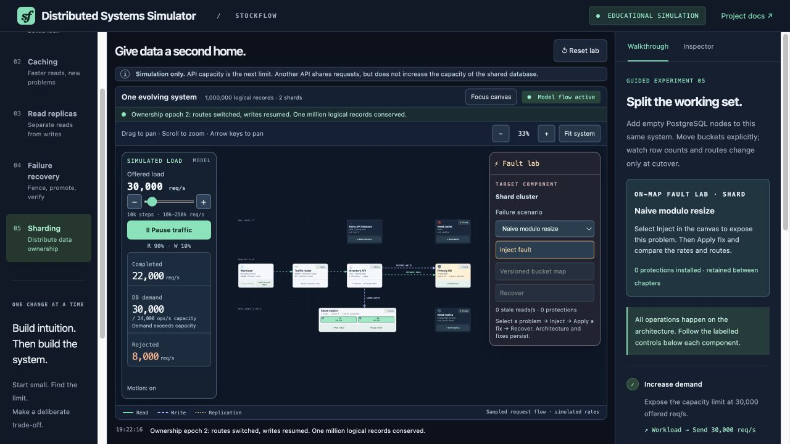

# From One Database to a Distributed System: Bottlenecks, Caches and Shards

*An interactive walkthrough of how database scaling changes performance, consistency and failure recovery—and why every improvement needs a second question.*

An inventory service is struggling under load. Someone suggests adding another API instance. Someone else suggests Redis. A third person recommends sharding.

All three proposals can be reasonable. They solve different problems.

Before choosing one, I want to know where requests spend their work, which data must be fresh, and what the system must preserve when a component fails. An architecture diagram is useful only if we can explain those decisions.

I built **Distributed Systems Simulator**, using an inventory scenario called StockFlow, to make that reasoning visible. You start with one service and one database, increase demand, then change one thing at a time. The same architecture stays on screen as routes change, components fail and data ownership moves.

[Open the free interactive demo](https://arifmehmood16.github.io/stockflow/) · [Explore the source](https://github.com/ArifMehmood16/stockflow)

The walkthrough below follows a simple teaching pattern: **predict the outcome, make a change, inspect the result, then challenge the assumption behind it.**

## Start with an explicit model

StockFlow represents stock lookups and inventory reservations. Its baseline assumptions are deliberately small enough to explain:

- One million virtual inventory records, represented by ownership counts.
- A workload of 90% reads and 10% writes.
- An API capacity of 22,000 requests per second per instance.
- A database capacity of 12,000 operations per second.
- An 80% hit rate for eligible reads when the cache is healthy.

**These are teaching constants, not measurements of Java, Redis or PostgreSQL.** Everything runs in the browser. The technology logos identify architectural roles; no services or databases are provisioned. Animated particles illustrate a sample of the flow, rather than individual requests.

The model deliberately treats database operations as comparable units of work. A production stock lookup and a contended reservation transaction would not necessarily cost the same amount. Keeping that distinction explicit lets us reason about the example without mistaking it for a sizing exercise.

## 1. Find the bottleneck before adding capacity

Open the demo and choose **Reset lab** if you have already experimented. On the Workload component, click **Start traffic**, then **Send 30,000 req/s**.

The model completes 12,000 requests per second and rejects 18,000. The database is the first constraint.



*Figure 1. Offered demand exceeds the database's assumed capacity. All displayed rates are simulated.*

Before adding anything, predict what a second API instance will change. It increases application capacity, but both instances still depend on the same database. In this baseline, completed throughput remains 12,000.

You can test that counterexample using **Build instance**, then reset before continuing. The important result is that the database limit survives application scaling.

In a real investigation, this would be a hypothesis to check against query cost, connection-pool waits, lock contention and storage behaviour. The simulator does not identify those causes. It makes the shared dependency visible and gives us a controlled way to reason about it.

## 2. Use caching to reduce work, then look for the next limit

From the baseline at 30,000 requests per second, choose **Build Redis** on the cache card. Wait for its readiness animation to finish.

With 27,000 reads and 3,000 writes per second, an 80% read hit rate changes the assumed database demand to:

```text
Read misses = 27,000 × (1 − 0.80) = 5,400 operations/s
Writes      = 3,000 operations/s
Total       = 8,400 database operations/s
```

The database now has enough capacity for that demand. Completed throughput rises to 22,000 requests per second, where the single API becomes the constraint.



*Figure 2. Caching reduces work reaching storage. The next bottleneck is the API.*

Now choose **Build instance**. Once it is ready, the model completes all 30,000 offered requests per second.



*Figure 3. The same application scaling action helps after the database constraint has been relieved.*

This sequence gives us a more useful explanation than “Redis makes the system faster”. Repeated reads avoid storage work, and application capacity becomes relevant after that reduction.

The hit rate is an assumption worth challenging. AWS's discussion of caching emphasises both reuse across requests and tolerance for eventual consistency. A cache provides little benefit when most queries are unique. [Caching challenges and strategies](https://aws.amazon.com/builders-library/caching-challenges-and-strategies/)

For inventory, I would distinguish a browsing view from the decision to reserve the last item. A cached stock count may be acceptable for display; an authoritative reservation needs a correctness rule at the write boundary. This demo does not implement reservation transactions or prove that overselling is impossible.

## 3. Break the cache that the system now depends on

Keep the cache and second API in place. Click **Faults** on the Redis card, select **Cache stampede**, then click **Inject fault**.

A stampede occurs when many callers try to refill missing or expired data together. The model represents this by reducing the assumed hit rate and multiplying origin work. Database demand rises sharply despite the unchanged offered request rate.



*Figure 4. The optimisation has introduced another failure mode. The multipliers illustrate amplification; they are not empirical predictions.*

Click **Coalesce + jitter** and compare the result. In this model, the protection bounds duplicate fills and restores the healthy cache assumption.

The two ideas address different parts of the problem. Request coalescing lets callers share a fill for the same key. Expiry jitter spreads expiration times. Neither should be treated as a universal switch that makes cache behaviour safe. In a real implementation I would also examine coordination across API instances, fill deadlines and what happens when the caller responsible for a fill disappears.

Try the other faults individually, using **Recover** between experiments. Installed protections persist until **Reset lab**, so reset when you want an untreated comparison:

- **Stale cache:** inspect the old-value refill race and apply **Version guard**. A freshness policy needs more than a high hit rate.
- **Cache penetration:** requests for missing identifiers reach storage repeatedly. **Negative cache** absorbs repeated misses; it cannot absorb an unlimited stream of unique identifiers.
- **Hot key:** demand concentrates on one key. A bounded local cache can help reads, but distributing copies introduces invalidation work. A heavily contended write still needs an ownership strategy.
- **Redis crash:** compare bounded fallback with recovery. Rejecting excess work can protect storage while leaving some requests unserved; the cache remains down until **Recover**.

AWS describes the broader risk as a service becoming dependent on its cache: when the cache is cold or unavailable, downstream demand can surge. That is why the failure experiment belongs immediately after the success experiment. [Caching challenges and strategies](https://aws.amazon.com/builders-library/caching-challenges-and-strategies/)

## 4. Separate read capacity from write authority

Reset the lab, choose **Read replicas**, send 30,000 requests per second, and build a replica. Follow the arrows: eligible reads move to the replica, writes remain on the primary, and the replication path is separate from client traffic.

This is the distinction I want the animation to teach. Another copy of the data can serve reads without creating another independent writer.

Inject **Replica lag** through the replica's fault controls, then apply **Pin fresh reads**. Freshness-sensitive reads return to the primary, increasing its demand. The mitigation changes the read route; it does not make the replica catch up instantly.

PostgreSQL documents that asynchronous replication can expose delayed data on a standby and can lose recent transactions during failover if their changes have not reached it. Those are separate concerns: freshness while serving reads, and possible data loss when choosing a replacement primary. [PostgreSQL: log-shipping standby servers](https://www.postgresql.org/docs/17/warm-standby.html)

Continue into **Failure recovery** with the replica present. Click **Fail primary**. Promotion remains unavailable until you select **Fence primary**, then **Promote replica**.

Fencing represents preventing the old primary from continuing to accept writes. The ordering makes the single-writer requirement visible. It does not implement isolation, verify replication progress or establish a safe recovery point. In a real design, I would require evidence for those conditions before treating the new primary as authoritative.

## 5. Add a shard, then explain why nothing improved

Reset again, choose **Sharding**, and send 30,000 requests per second. Click **Add shard** and let it become ready.

The new shard owns zero records. The original shard still owns all one million.



*Figure 5. Provisioning a node does not redistribute existing data or traffic.*

The simulator uses 16 logical buckets and a versioned ownership map. The map says which shard owns each bucket; an epoch identifies the current map version. Adding a machine changes the available destinations. Moving ownership changes where work can go.

Follow the controls on the shard cluster:

1. **Pause writes** to moving buckets. Existing ownership continues to serve reads.
2. **Copy buckets** to stage the transfer.
3. **Verify copy** before allowing a switch.
4. **Switch owners** to activate the new ownership map.



*Figure 6. After the model's ownership switch, each shard owns half the records. The total remains one million.*

These are state transitions, not real data copying or checksum verification. Their purpose is to teach ordering and invariants: an empty node adds no balanced capacity, an interrupted transfer retains the original owners, and the final record count remains unchanged.

A production migration needs an answer for writes arriving during transfer, stale routers, retries and partial failures. Pausing affected writes is the demo's explicit simplification. Supporting uninterrupted writes would require a migration protocol beyond what this model demonstrates.

Now use the shard fault controls to explore naive modulo routing and a hot tenant. Changing `hash(key) % N` changes destinations when `N` changes; changing the formula alone does not move stored data. A stable bucket map separates placement decisions from node count.

Likewise, balanced record counts do not imply balanced traffic. If one tenant dominates requests and stays on one shard, adding unrelated shards cannot remove that tenant's local constraint. The relevant question becomes how to partition that workload—or limit it while protecting other tenants.

## What I chose to model—and what I left out

The interface keeps one cumulative system across five chapters. Controls sit beside the components they change, hover details describe the current state, and the guide asks the reader to connect an action with its consequence. Reset makes counterexamples repeatable.

Underneath, small JavaScript modules separate state transitions, capacity calculations, routing and presentation. Tests check the teaching contracts: replicas do not add primary write capacity, shards begin empty, interrupted migrations preserve ownership, and completed plus rejected requests account for offered demand.

The model does not reproduce real queues, latency distributions, lock scheduling, network partitions, consensus or durable recovery. The rejected count is a capacity-model result, not a measured HTTP timeout rate. Clicking a recovery button cannot establish that a database has recovered safely.

I chose that boundary so a reader can explore cause and effect without installing a database or generating load. The next step for production work would be to turn each hypothesis into an implementation-specific experiment with explicit correctness and failure criteria.

AI tools assisted development and editorial work. The source and tests are public so the assumptions can be inspected and challenged alongside the presentation.

## Try a prediction before the next click

[Open the simulator](https://arifmehmood16.github.io/stockflow/) and change the order of the first experiment: scale the API before adding the cache. Then add an empty shard and ask whether the new node has earned any traffic yet.

For each change, write down three things: **the work it removes or redistributes, the correctness condition it depends on, and the failure mode it introduces.**

That is the reasoning I want this tool to help people practise. The diagram is the starting point; explaining why its behaviour changes is the lesson.

[Source code and local setup](https://github.com/ArifMehmood16/stockflow) · [Model assumptions and limitations](https://github.com/ArifMehmood16/stockflow/blob/main/docs/SIMULATION.md)
