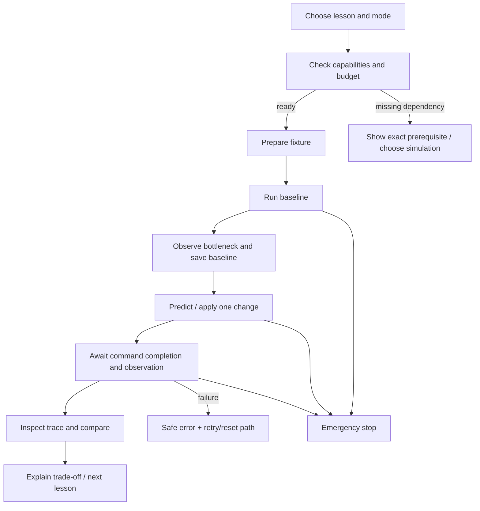
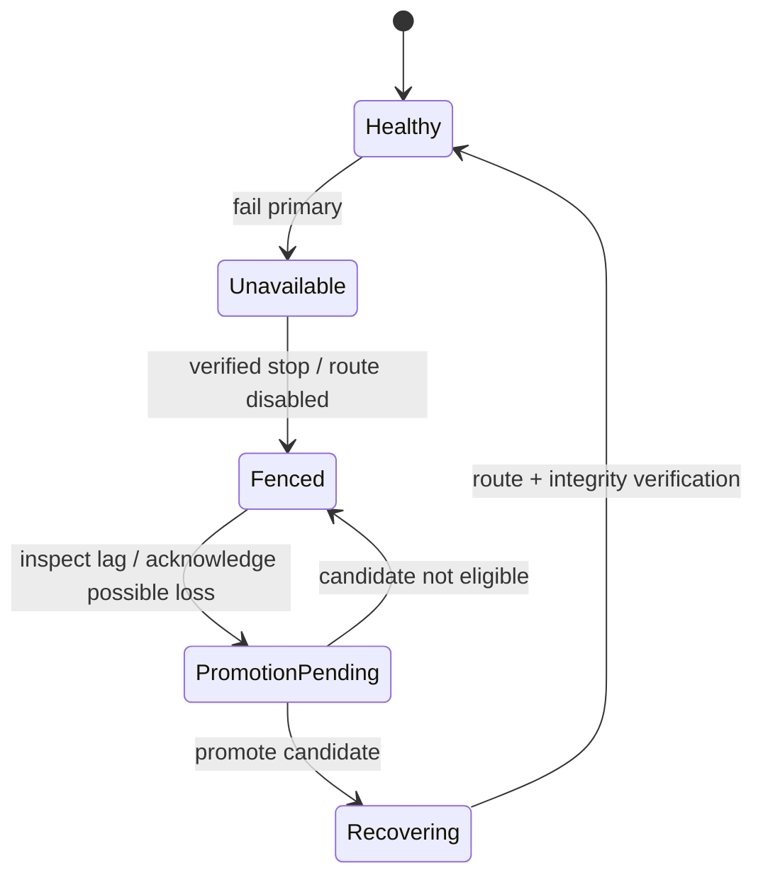
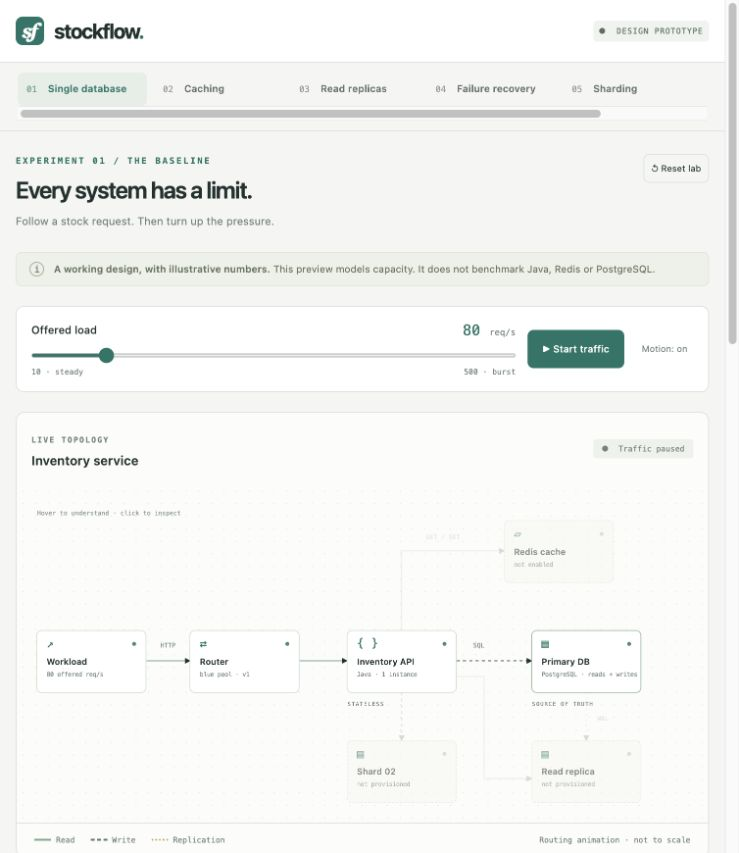

# UX specification, wireframes and flows

## Visual direction

A calm engineering workbench. Warm off-white shell, dark ink text, teal for primary interactions, amber for degraded state, red for unavailable. Avoid making every service a different bright colour. Use labels/icons/patterns as well as colour. Title “StockFlow”; subtitle “Inventory, under pressure”. Light dotted topology surface, restrained flat panels, compact monospace metrics and a strong readable explanation column.

Spacing: 4/8/12/16/24/32 px; base text 14–16 px; 28 px page heading; 12 px metadata; corner radius 8–12 px. Proposed production font: system sans and system monospace, no remote font dependency. Controls min 40 px desktop / 44 px touch. Contrast target WCAG AA. Proposed viewport: 1440×900; minimum usable width 375 px.

## Desktop lab wireframe

```text
┌──────────────────────────────────────────────────────────────────────────────┐
│ StockFlow / Inventory lab       SIMULATION · seed 42     Budget    Reset      │
├───────────────┬────────────────────────────────────┬─────────────────────────┤
│ LEARN         │ 04 / Cache the read path            │ Guide | Inspect         │
│               │ Start → overload → improve         │                         │
│ 01 Baseline   │                                    │ Step 2 of 4             │
│ 02 Scale      │ Offered load [────●──] 300 req/s    │ Enable the read cache   │
│ 03 Queries    │ [Start / Pause] [Stop]              │                         │
│ 04 Cache   ●  ├────────────────────────────────────┤ WHY                     │
│ 05 Stale      │ Client → Proxy → API × 2           │ Repeated reads compete  │
│ 06 Stampede   │                   ↘ Redis          │ with writes for DB time │
│ 07 Replicas   │                    → Primary       │                         │
│ 08 Recover    │                         ⇣ WAL      │ [Enable Redis]          │
│ 09 Shards     │                       Replica      │                         │
│ 10 Hot key    │ hover: role / queue / source       │ Watch for               │
│ 11 Deploy     │ click: pin inspector               │ hit rate rises; primary │
│ 12 Resilience │ read ── write ┄┄ replication ···   │ reads decrease          │
│ 13 Backups    ├────────────────────────────────────┤                         │
│               │ Completed | latency | errors | lag │ Trade-off               │
│ [Compare]     │ request timeline / events          │ display can become stale│
└───────────────┴────────────────────────────────────┴─────────────────────────┘
```

Actual prototype groups the curriculum into six chapters for visual review; production expands chapters into the 13 lessons. Avoid presenting unimplemented prototype controls as real infrastructure.

## Right panel

Guide default: hypothesis, current instruction, one primary action, observable success condition, explanation and trade-off. Anchor a subtle outline to target controls. Never put a modal coach mark over emergency stop. Progress advances from observation, not click. “Why didn't this help?” appears when throughput stays flat and points to next bottleneck.

Inspect: selected node role, instance/version, health, current work, source of metrics, constraints, queue/pool, related request IDs. DB adds write/replay position, row version and role; Redis adds TTL/version/hit/miss/eviction; proxy adds active targets/drain state; shard router adds bucket/epoch. Hover/focus shows brief tooltip; click pins full panel until close. Touch uses tap. Tooltip dismisses with Escape and never traps keyboard focus.

## Request and data animation

Read line solid teal, write line dashed dark, WAL dotted amber; text legend always present. Edge arrowheads show direction. Return path distinguishable. Particle speed is time-compressed; display “sampled traces, animation not to scale”. Real throughput remains numerical. At high load aggregate streams, max 30 particles; never render one dot per real request. Source badge distinguishes cache, replica, primary. Failures mark edge with x and text. Selecting a trace highlights only its route; show scheduler/admission/API/pool/SQL/cache/return spans with duration and sample provenance.

Motion is optional. Respect prefers-reduced-motion plus saved toggle. Reduced motion uses edge highlights and live text, not moving particles. Metric updates at 1 Hz avoid layout jitter; announce meaningful run/lesson/fault state changes politely, not every metric tick.

## Comparison wireframe

```text
Baseline A                 Change: enable cache            Run B
Mode / seed / fixture      [configuration diff]            Mode / seed / fixture
Offered / completed        equal window? YES               Offered / completed
p50 / p95 / p99             sample counts                  p50 / p95 / p99
DB read rate               cold vs warm separated          DB read rate
Invariant result           [view evidence]                Invariant result
Cost: +Redis memory; stale display possible. [Export report]
```

Reject cross-mode comparison. Warn on workload/fixture mismatch; allow explanation but do not label it a controlled improvement. Baseline freezes only after complete window. Zero requests renders “not enough samples”, not zero latency.

## Responsive states

1440+: 208 px lesson rail, fluid centre, 320 px guide; topology min 600 px. 1024: collapse rail to chapter selector, retain guide. 768: guide becomes lower tab, architecture pans inside labelled region. 375: stacked controls/metrics, topology has accessible ordered component list, Guide and Inspect tabs below; no body horizontal overflow. Preserve stop action at top. An export report is readable without the graph.

## Interaction flows





## Required non-happy states

Preparing: disable competing mutations, show steps and cancel. Disconnected SSE: freeze values with last-observed time and reconnect indicator; controls disabled except local stop request/retry. Fault timeout: remove fault and emit event; don't silently mark lesson successful. Resource budget refusal: proposed/requested totals and smaller profile action. Stale topology revision: refresh snapshot and preserve intent for explicit retry. Command failure: safe reason, original configuration and rollback status. Empty trace list: “No sampled requests yet” with run action. Missing measurements: em dash/unknown. Busy action buttons reject repeated click while command pending.

## Accessibility acceptance

Semantic landmarks/headings, visible focus, real buttons/labels, no hover-only information, Escape close, focus restored after dialog, no colour-only health, 200% zoom, screen-reader topology list and concise event announcements. Test keyboard walkthrough and reduced motion at 375/768/1440. Automated axe checks plus manual inspection; automated pass is not full accessibility certification.

## Prototype scope

Delivered: six chapter selections, traffic start/pause, bounded load slider, cache/replica/shard/instance/deployment toggles, fenced primary promotion, animated architecture, hover/focus/pinned inspector, metric breakdown, right guide, activity log, reset and reduced motion. Instant model transitions are for design review. Stale-fill races, real replication, detailed traces, report export and compare are specified, not falsely simulated by random counters.

## Captured preview

The responsive browser preview below was captured during Phase 0. At narrower widths the guide stacks below the architecture; the desktop wireframe above defines the side-by-side layout.


